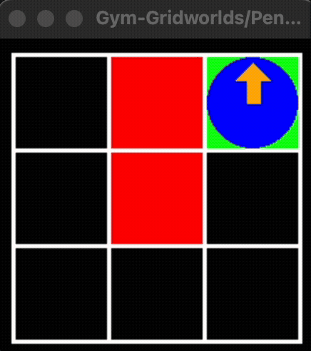
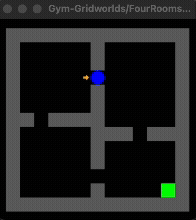
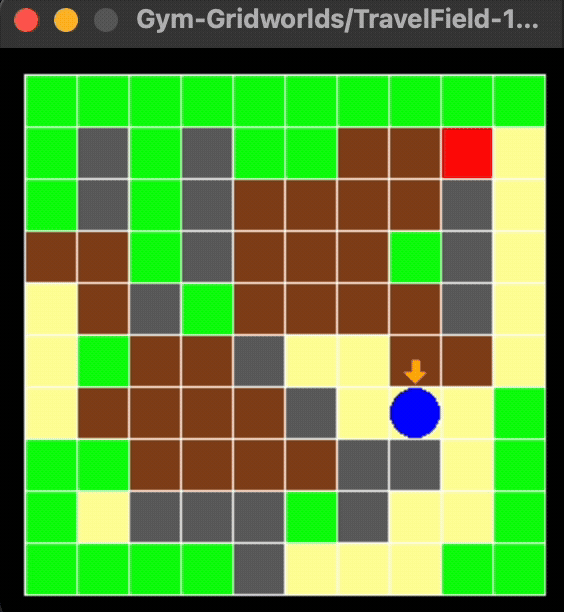
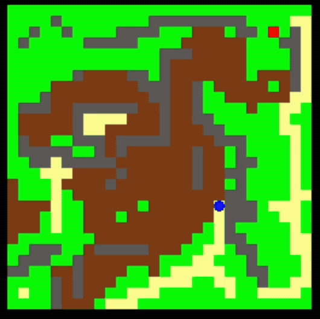

## Overview
The overall objective of our project is to design, implement, and evaluate a learning-based navigation policy that can guide an autonomous agent through 2D obstacle environments. 

We will build
gridworld environments to train and compare several RL agents (Q-learning, DQN, and PPO). 

We evaluate them based on reward functions and analyze how reward
shaping and hyperparameter choices influence stability, sample efficiency, and learned behavior.

A summary of the project can be found here: [final_report.pdf](https://alisonands.github.io/docs/505_final_report_v2.pdf)

## Structure
All code for training and testing are in the [test_envs](test_envs) folder. Each file trains, tests, and evaluates models for the respective environment.

## Results
- 3x3 trained on DQN (more details in report) \

- 3x3 trained on PPO \
{width=200px}
- Four Rooms env \
{width=200px}
- Travel Field env \
{width=200px}
- Bigger Travel Field (Unfortunately, this hasen't worked out. yet...) \
{width=200px}